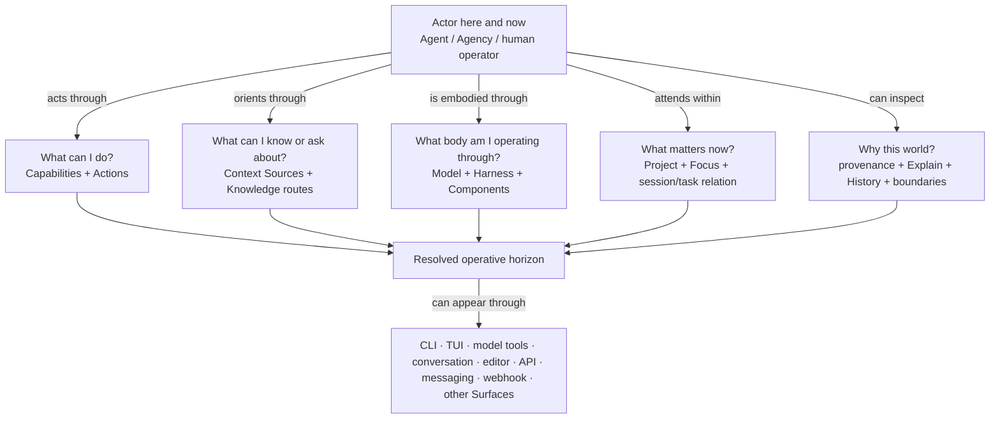
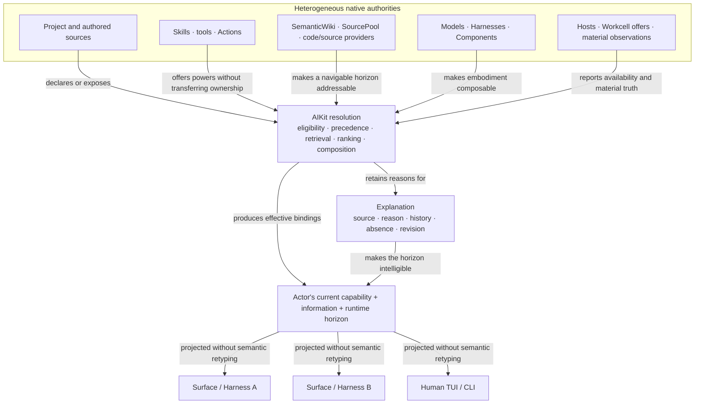
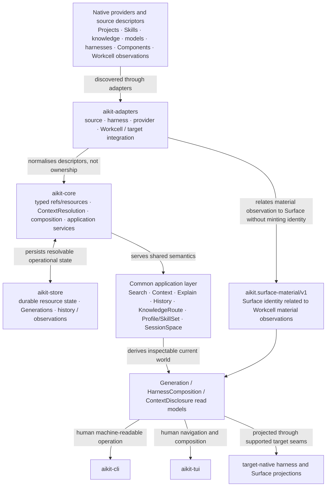

# AIKit V2 Visual Product Understanding

**Status:** canonical V2 product-understanding surface  
**Architecture status:** accepted `main`, including restored composition application semantics, common Explain/History, Knowledge navigation, SessionSpace, and persistent Surface ↔ Workcell material observation  
**Sources:** `01-PRODUCT-AND-OWNERSHIP.md` through `10-PERSISTENT-AGENCY-AND-MATERIAL-HOSTING.md`, current Rust crates, and accepted V2 conformance evidence.

AIKit is not primarily a catalogue. It is the system by which an actor can inhabit an operative horizon whose powers, information, body, boundaries, provenance and surfaces are discoverable and explainable without AIKit taking ownership of the things it resolves.

## 1. Experience — the actor has a resolved working world

The experience is therefore not “choose something from a registry”. The actor can ask what world is available, progressively disclose what matters, and understand why a capability, source, body component or Surface is present or absent.

## 2. Product / conceptual relation — heterogeneous worlds become one explainable horizon

The central invariant is visible in the direction of the arrows: AIKit **resolves relations among externally and internally described resources without becoming the canonical owner of either side**. One Action can appear on several Surfaces; one source can be askable without being loaded; one Agent can change body without changing identity.

## 3. Architecture — accepted V2 implementation seams

This is an ownership diagram as much as a component diagram. Workcell remains owner of process/service/endpoint/network/lifecycle truth; application and Project owners retain Action/source meaning; target runtimes retain their native plugin/service semantics. AIKit owns the resolution, explanation, projection and observed activation relation.

## 4. Diagram audit

| Existing visual | Class | Disposition |
|---|---|---|
| `01-PRODUCT-AND-OWNERSHIP.md` Human/Project Sources → AIKit → Harness/Factory/Workcell → Execution | cross-product conceptual | **Preserve, but not as the first product picture.** It locates AIKit among neighbours rather than showing the actor's experienced horizon. |
| `02-RESOLUTION-AND-CONTEXT-COGNITION.md` authored preference → resolution → effective binding | specialist conceptual | **Preserve.** It explains a critical resolution law. |
| disclosure ladder EXISTS → KNOWN → ASKABLE → RETRIEVED → FOCUSED | experiential/epistemic specialist | **Preserve.** It is a valuable detailed view inside the information-horizon relation. |
| operational-state ladders catalogued → eligible → enabled → projected → loaded → invoked | architectural specialist | **Preserve.** They explain state semantics, not whole-product meaning. |
| `03-ACTOR-RUNTIME-AND-PROJECTION.md` Agent/Agency/Session/Execution and HarnessComposition diagrams | conceptual/architecture | **Preserve.** They remain the correct identity/body deepening after the resolved-world diagram. |
| older `docs/ARCHITECTURE.md` / prior-art diagrams | historical / implementation lineage | **Do not promote over V2.** Retain for provenance where still useful. |

## 5. Verification

**Semantic:** the first diagram is an operative horizon, not a catalogue. The conceptual diagram shows why resolution exists and why multiple Surfaces do not imply multiple semantic owners.

**Implementation:** the architecture reflects accepted current V2 seams, including common Explain/History and Surface-material observation. It does not claim Workcell material lifecycle ownership, application Action ownership, or a universal target plugin protocol.

**Cross-product:** AIKit is not Central: it resolves authored sources rather than owning durable human truth. It is not Actuation: it resolves the body/world of situated agency rather than defining agency's determination/Return grammar. It is not Workcell: it asks what operative world should be available; Workcell makes material execution true.

## 6. Public-site projection

Project the **resolved operative horizon** as the primary public/design image. The heterogeneous-input conceptual relation is suitable for a deeper “how AIKit works” explainer. The crate/application architecture should remain technical documentation, with richer UI designs derived from the same semantic relations rather than turning resource cards into the product metaphor.